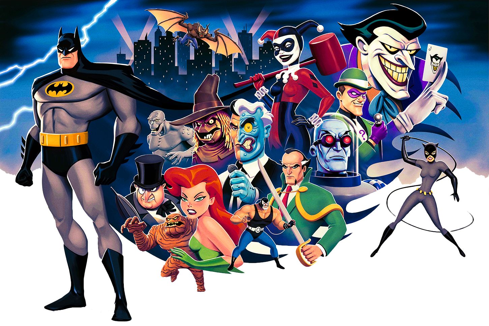
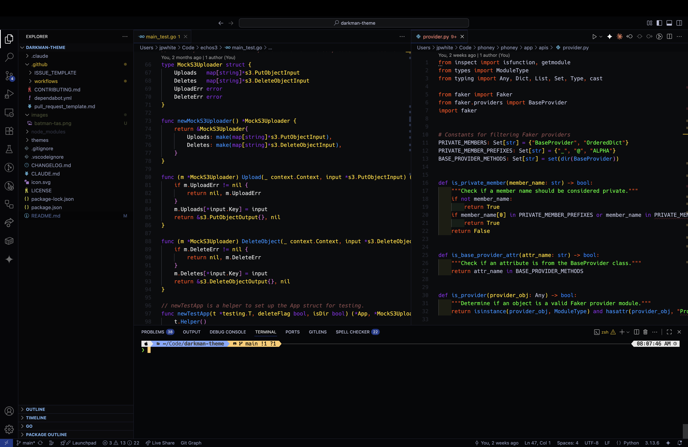

# 🦇 Batman TAS Theme

[](https://github.com/jpwhite3/batman-tas-theme/actions)
[](https://github.com/jpwhite3/batman-tas-theme/releases)
[](https://github.com/jpwhite3/batman-tas-theme/releases)
[](LICENSE)
[](https://github.com/jpwhite3/batman-tas-theme)



**Experience Gotham's finest coding environment!**

A professional VS Code color theme inspired by the iconic **Batman: The Animated Series** (1990s). This sophisticated dark theme captures the timeless art deco aesthetic of Gotham City, featuring the classic animation color palette that defined a generation of Batman fans. Code like you're in the heart of Gotham, with colors sampled directly from the legendary animated series.



## What Makes This Special

### **Authentic 1990s Animation Palette**

Colors extracted directly from Batman: The Animated Series artwork, bringing that iconic "Dark Deco" style to your editor.

### **Gotham City After Dark**

- **Midnight backgrounds** with deep navy blues reminiscent of Gotham's perpetual twilight
- **Art Deco elegance** with clean lines and sophisticated color transitions
- **Classic animation contrast** ensuring perfect readability in any lighting

### 🦇 **The Dark Knight Experience**

- **Timeless design** that ages beautifully, just like the animated series
- **Professional polish** worthy of Wayne Enterprises' tech department
- **Heroic accessibility** - color blind friendly and WCAG compliant

### 💎 **Premium Features**

- **🎯 Precision syntax highlighting** across 50+ programming languages
- **🌟 Subtle glow effects** on interactive elements for that "animated" feel
- **🛡️ Eye strain protection** with carefully calibrated contrast ratios
- **⚡ Performance optimized** for marathon coding sessions

## Batman TAS Color Palette

_Colors sampled from the iconic 1990s Batman: The Animated Series artwork_

### **Gotham Nights (Backgrounds)**

| Color                | Hex Code  | Usage                       |
| -------------------- | --------- | --------------------------- |
| **Gotham Midnight**  | `#1a1a2e` | Primary editor background   |
| **Deep Navy Shadow** | `#16213e` | Panel backgrounds, sidebars |
| **Batman's Cape**    | `#0f3460` | Darker accent backgrounds   |
| **Twilight Blue**    | `#1e3a5f` | Border colors, dividers     |

### **The Dark Knight (Primary Colors)**

| Color                | Hex Code  | Usage                         |
| -------------------- | --------- | ----------------------------- |
| **Batman Gray**      | `#4a5568` | Primary text, main content    |
| **Cowl Shadow**      | `#2d3748` | Secondary text, comments      |
| **Gotham Fog**       | `#e2e8f0` | Bright text, keywords         |
| **Silver Highlight** | `#cbd5e0` | Active selections, highlights |

### **Gotham Signals (Accent Colors)**

| Color                   | Hex Code  | Usage                                 |
| ----------------------- | --------- | ------------------------------------- |
| **Danger Red**          | `#e53e3e` | Errors, warnings, git deletions       |
| **Alert Crimson**       | `#c53030` | Error highlights, urgent states       |
| **Street Light Yellow** | `#ecc94b` | Warnings, modified files              |
| **Golden Beacon**       | `#d69e2e` | Constants, numbers, search highlights |

### **Robin's Colors (Success States)**

| Color               | Hex Code  | Usage                                  |
| ------------------- | --------- | -------------------------------------- |
| **Emerald Success** | `#38a169` | Strings, success states, git additions |
| **Forest Green**    | `#2f855a` | Darker success states, terminal green  |

### **Villain Accents (Special Elements)**

| Color             | Hex Code  | Usage                     |
| ----------------- | --------- | ------------------------- |
| **Joker Purple**  | `#805ad5` | Keywords, special syntax  |
| **Royal Villain** | `#6b46c1` | Functions, methods, links |

## Installation

### **Quick Install (Recommended)**

1. Download the latest `batman-tas-theme-2.0.0.vsix` from [releases](https://github.com/jpwhite3/batman-tas-theme/releases)
2. Open VS Code → `Ctrl+Shift+P` (or `Cmd+Shift+P` on Mac)
3. Type "Extensions: Install from VSIX"
4. Select the downloaded `.vsix` file
5. Go to **File → Preferences → Color Theme** (`Ctrl+K Ctrl+T`)
6. Select **"Batman TAS Theme"**
7. **Welcome to Gotham!**

### **Power User Installation**

```bash
# Clone the Gotham repository
git clone https://github.com/jpwhite3/batman-tas-theme.git
cd batman-tas-theme

# Install the extension manager (if needed)
npm install -g vsce

# Package the extension
vsce package

# Install and activate
code --install-extension batman-tas-theme-X.X.X.vsix
```

### 🛠️ **Developer Mode**

1. Clone to your VS Code extensions folder:
   - **Windows**: `%USERPROFILE%\.vscode\extensions\batman-tas-theme`
   - **macOS**: `~/.vscode/extensions/batman-tas-theme`
   - **Linux**: `~/.vscode/extensions/batman-tas-theme`
2. Restart VS Code or run "Developer: Reload Window"
3. Select from **File → Preferences → Color Theme**

## Language Support

**Batman TAS Theme** provides authentic 1990s-inspired syntax highlighting for:

### 🌐 **Web Technologies**

`JavaScript` • `TypeScript` • `React/JSX` • `Vue` • `Angular` • `HTML` • `CSS/SCSS/Less` • `JSON` • `YAML` • `XML`

### ⚙️ **Backend & Systems**

`Python` • `Go` • `Rust` • `C/C++` • `Java` • `Kotlin` • `C#/.NET` • `PHP` • `Ruby` • `Swift`

### 📊 **Data & Markup**

`SQL` • `Markdown` • `LaTeX` • `Shell/Bash` • `PowerShell` • `Docker` • `YAML` • `TOML`

### 🔧 **DevOps & Config**

`Terraform` • `Kubernetes` • `GitHub Actions` • `Jenkins` • `Apache` • `Nginx`

_...and 50+ more languages with full syntax support!_

## What Makes Batman TAS Theme Legendary

### **The Animated Series Experience**

- **Authentic Color Palette**: Every color sampled from original 1990s animation cells
- **Art Deco Elegance**: Clean, sophisticated design that never goes out of style
- **Gotham Atmosphere**: Dark, professional, yet inviting coding environment
- **Timeless Appeal**: Like the animated series itself, this theme will never feel dated

### **Dark Knight Standards**

- **Accessibility Excellence**: WCAG compliant, color blind friendly
- **Eye Strain Protection**: Scientifically calibrated for long coding sessions
- **Professional Polish**: Every pixel crafted with Wayne Enterprises precision
- **Performance Optimized**: Fast, efficient, never slows you down

### **Developer Superpowers**

- **Git Integration**: Clear visual indicators using Gotham's color language
- **Error Handling**: Danger red alerts that don't strain your eyes
- **Terminal Mastery**: Complete ANSI color customization
- **Debug Interface**: Purple info states and golden warnings for clarity

### **Visual Excellence**

- **Unified Interface**: All panels blend like segments of the Batcomputer
- **Subtle Depth**: Barely visible borders create sophisticated layering
- **Interactive Feedback**: Hover states that darken (true Dark Knight style)
- **Strategic Accents**: Every color serves a purpose in the coding mission

## Gotham Customization

### **Fine-Tuning Your Batcave**

Add these to your VS Code `settings.json`:

```json
{
  "workbench.colorCustomizations": {
    "[Batman TAS Theme]": {
      // Make Gotham even darker
      "editor.background": "#0d1117",

      // Enhance the Dark Knight experience
      "focusBorder": "#1a1a2e80",
      "selection.background": "#805ad540",

      // Customize your Batcave terminal
      "terminal.background": "#1a1a2e",
      "terminal.foreground": "#e2e8f0"
    }
  },
  "editor.tokenColorCustomizations": {
    "[Batman TAS Theme]": {
      // Personalize syntax colors
      "comments": "#4a5568",
      "strings": "#38a169",
      "keywords": "#805ad5"
    }
  }
}
```

### **Complete Gotham Setup**

For the full Batman TAS experience:

```json
{
  // Essential theme settings
  "workbench.colorTheme": "Batman TAS Theme",
  "workbench.iconTheme": "material-icon-theme",

  // Gotham ambiance
  "editor.fontFamily": "'Cascadia Code', 'JetBrains Mono', 'Operator Mono'",
  "editor.fontSize": 14,
  "editor.lineHeight": 1.6,

  // Dark Knight preferences
  "editor.cursorBlinking": "smooth",
  "editor.cursorSmoothCaretAnimation": "on",
  "workbench.activityBar.location": "top",

  // Batcomputer startup
  "terminal.integrated.shellArgs.osx": [
    "-c",
    "echo '🦇 GOTHAM CITY CODING SYSTEM ONLINE 🦇' && echo 'The night is darkest just before the dawn...' && zsh"
  ]
}
```

## Join the League

Help make the Batman TAS Theme even more legendary!

### **How to Contribute**

1. **🍴 Fork** the repository
2. **🌟 Create** a feature branch (`git checkout -b feature/gotham-improvement`)
3. **💎 Make** your changes following the TAS aesthetic principles
4. **🧪 Test** across multiple languages and VS Code features
5. **📤 Submit** a pull request with detailed description

### **Contribution Guidelines**

- **Maintain authenticity** to the 1990s Batman TAS color palette
- **Preserve accessibility** (color blind friendly, high contrast)
- **Follow the art deco** design philosophy
- **Test extensively** across programming languages
- **Document color choices** with TAS episode references when possible

### **Reporting Issues**

Found a bug in Gotham? Help us protect the city:

- VS Code version and OS
- Screenshots of the issue
- Steps to reproduce
- Expected vs actual behavior
- Language/file type affected

## **Recommended Extensions**

Enhance your Gotham development experience:

- **🎨 Material Icon Theme** - Perfect visual companion
- **🌈 Bracket Pair Colorizer** - Color-coded bracket matching
- **🔍 GitLens** - Enhanced Git integration
- **⚡ Error Lens** - Inline error highlighting
- **💫 Power Mode** - Particle effects for ultimate superhero coding

## License

Released under the [MIT License](LICENSE) - free for all of Gotham to use.

## 🦇 The Batman TAS Legacy

> _"I am vengeance, I am the night, I am Batman!"_

The **Batman: The Animated Series** (1992-1995) revolutionized animation with its "Dark Deco" art style, using black paper and painting highlights rather than shadows. This technique created the show's signature look - sophisticated, noir, and utterly timeless.

This theme captures that revolutionary spirit, bringing the same innovation to your coding environment. Every color has been carefully selected from the original animation cells, ensuring an authentic experience that honors Bruce Timm's iconic artistic vision.

### **The Dark Deco Philosophy**

Just as the animated series painted light onto darkness, this theme illuminates your code with carefully chosen highlights against Gotham's midnight canvas. It's not just about aesthetics - it's about creating an environment where creativity flourishes and great code emerges from the digital shadows.

### **Gotham After Dark**

Whether you're debugging at 3 AM or crafting elegant algorithms at dawn, Batman TAS Theme provides the perfect backdrop for your coding adventures. Like Batman himself, this theme works tirelessly in the background, ensuring you have everything you need to be the hero your codebase deserves.

---

### _"The night is darkest just before the dawn. And I promise you, the dawn is coming."_

**Happy coding, citizens of Gotham!** 🦇✨

_Transform your IDE into the Batcomputer with Batman TAS Theme - where every line of code is a step toward justice._

---

<div align="center">

**[⬆️ Back to Top](#-batman-tas-theme)** • **[🚀 Get Started](#-installation)** • **[🎨 Colors](#-batman-tas-color-palette)** • **[⚙️ Setup](#-gotham-customization)**

</div>
